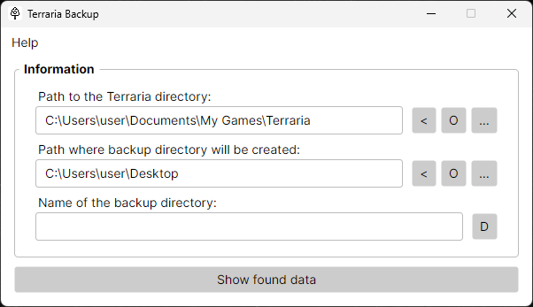
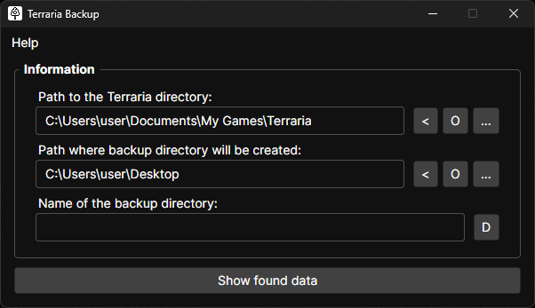

# Terraria Backup

**Backup your Terraria players and worlds.**

Easily backup some or all of your Terraria players and worlds.

## System Requirements 

### Version 2.0.0 and newer

- Operating systems:
  - Windows: 8.1 / 10 / 11 (x64 / arm64)
  - macOS: 10.14 / 10.15 / 11 / 12 / 13 / 14 / 15 (x64 / arm64)
  - Linux: Debian 9+, Ubuntu 16.04+, Fedora 30+ (x64 / arm64)
- [.NET 9.0 Runtime (64-bit)](https://dotnet.microsoft.com/download/dotnet/9.0)

### Version 1.1.0

- Operating systems:
  - Windows: 10 / 11 (64-bit)
- [.NET 9.0 Desktop Runtime (64-bit)](https://dotnet.microsoft.com/download/dotnet/9.0)

### Version 1.0.0 and older

- Operating systems:
  - Windows: 10 / 11 (64-bit)
- [.NET 8.0 Desktop Runtime (64-bit)](https://dotnet.microsoft.com/download/dotnet/8.0)

## Screenshots

## License

"Terraria Backup" is distributed under the [MIT License](LICENSE).