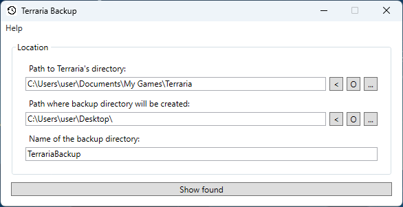

# Terraria Backup

**Backup your Terraria players and worlds.**

Easily backup some or all of your Terraria players and worlds.

## System Requirements 

- Windows 10/11 (64-bit)
- [.NET 8.0 Desktop Runtime (64-bit)](https://dotnet.microsoft.com/download/dotnet/8.0)

## Usage

There is no need to install the program, it is already ready to run.

## Screenshots

## License

"Terraria Backup" is distributed under the [MIT License](LICENSE).